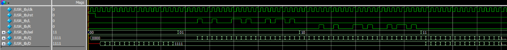

# 4-Bit Universal Shift Register
This project implements a 4-bit Universal Shift Register capable of holding data, shifting left, shifting right, and parallel loading. The design is modular, instantiating a 4-to-1 multiplexer and D Flip-Flops to build the top-level register architecture.

## Files Included
* USR.v:  top-level module.
* USR_tb.v:  testbench.
* four21mux.v: 4-to-1 multiplexer used for data selection.
* d_ff.v: D flip-flop used for sequential data storage.
* USR Schematic.png: RTL schematic mapped by DigitalJS.
* Waveform.png: ModelSim simulation.

## I/O
* clk: clock signal (Rising edge triggered)
* rst: Asynchronous reset (Active high)
* sel[1:0]: 2-bit mode selection line
* D[3:0]: 4-bit parallel data input
* L: Serial input bit for Left Shift operation
* R: Serial input bit for Right Shift operation
* Q[3:0]: 4-bit register output

## Operation Modes
|sel | 
| 00 | Hold; maintains current state (Q remains unchanged)
| 01 | Shift left; pulls new bit from L
| 10 | Shift right; pulls new bit from R
| 11 | Parallel load; loads 4-bit data directly from D into Q 

## RTL Schematic

## Simulation Waveform

