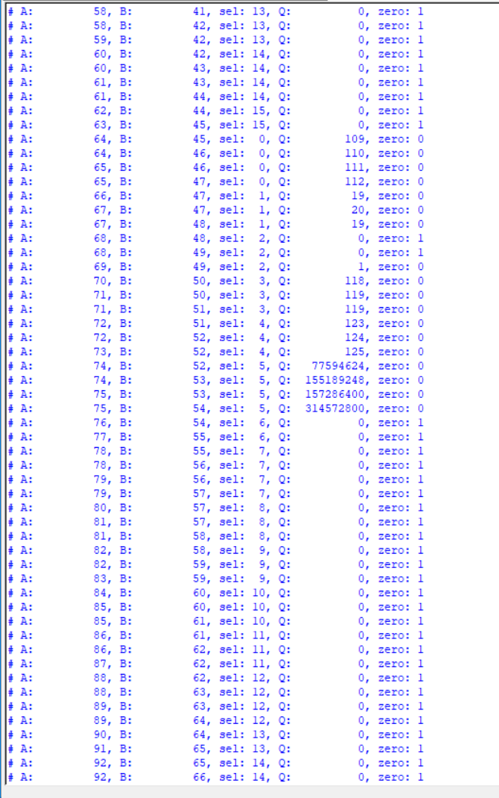
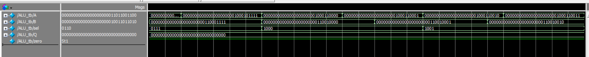

# 32-Bit ALU for RISC-V
This project implements a 32-bit Arithmetic Logic Unit (ALU) designed for RISC-V. It serves as the main execution unit handling addition, subtraction, bitwise logic, shifts, and comparisons using a strictly combinational architecture.

## Files Included
* Code/ALU_32b.v: ALU module.
* Code/ALU_tb.v: testbench.
* ALU schematic.png: RTL schematic mapped by DigitalJS.
* Table.png: ModelSim simulation output.

## I/O
* A[31:0]: 32-bit A input
* B[31:0]: 32-bit B input
* sel[3:0]: 4-bit selection line
* Q[31:0]: 32-bit output
* zero: 1-bit zero flag output (high when Q=0)

## Operation Modes
| sel  | action |
|:---:|:--- |
| 0000 | ADD; Arithmetic addition (A + B) |
| 0001 | SUB; Arithmetic subtraction (A - B) |
| 0010 | AND; Bitwise logical AND (A & B) |
| 0011 | OR; Bitwise logical OR (A | B) |
| 0100 | XOR; Bitwise logical XOR (A ^ B) |
| 0101 | SLL; Logical Shift Left by bottom 5 bits of B |
| 0110 | SRL; Logical Shift Right by bottom 5 bits of B |
| 0111 | SRA; Arithmetic Shift Right (preserves sign bit) |
| 1000 | SLT; Set Less Than (Signed comparison)  |
| 1001 | SLTU; Set Less Than Unsigned (Unsigned comparison) |

## RTL Schematic

## Simulation Output

## Simulation Waveform

